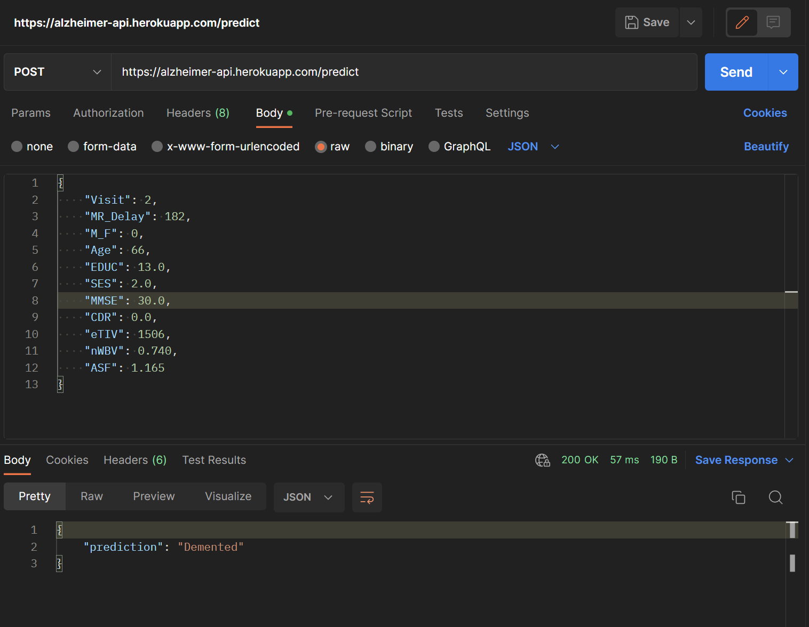

# Alzheimers Prediction Application
 The aim of this project is to create a Machine Learning model that 
 can take the MRI data of a patient and generate a prediction regarding the diagnosis of Alzheimer's i.e. whether the 
patient is Demented or Non-demented.
Using the data from the user to predict if the patient has Alzheimer's or not

_app.py_: Contains the fastapi code for the ML model\
_.ipynb_: Contains the machine learning model for Alzheimer's detection

Inputs:
_Visit, MR Delay, M/F, Hand, Age, EDUC, SES, MMSE, CDR, eTIV, nWBV, ASF_

Output:
_Group_

 Steps followed:
 1. Generate a new environment and install necessary libraries
 2. Generate Machine Learning model for the patient data and create pickle file
 3. Create an API using fastapi and test it on http://127.0.0.1:8000/predict or http://127.0.0.1:8000/docs to use
the OpenAPI for interactive API.
 4. Deploy the API on Docker by creating the Dockerfile
5. Create Procfile and Deploy the app on Heroku web server
6. Use this [ML model API](https://alzheimer-api.herokuapp.com/predict) link to send a POST request with 
the inputs in the format specified in _inputs.txt_ as shown below.

---
## References
1. https://www.geeksforgeeks.org/deploying-ml-models-as-api-using-fastapi/
2. https://github.com/krishnaik06/FastAPI
3. [How To Deploy Machine Learning Models Using FastAPI-Deployment Of ML Models As API’s](https://www.youtube.com/watch?v=b5F667g1yCk)
